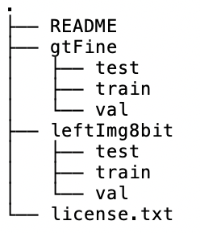

# Multi-weather city: Adverse weather stacking for autonomous driving

Contributors:
- Valentina Mușat, [Oxford Robotics Institute](https://ori.ox.ac.uk/), University of Oxford
- Ivan Fursa, [Autonomous Driving Group](https://www.brookes.ac.uk/Research/Units/TDE/Groups/Autonomous-Driving-and-Intelligent-Transport/), Oxford Brookes University
- Paul Newman, [Oxford Robotics Institute](https://ori.ox.ac.uk/), University of Oxford
- Fabio Cuzzolin, [Visual Artificial Intelligence Laboratory](https://cms.brookes.ac.uk/staff/FabioCuzzolin/), Oxford Brookes University
- Andrew Bradley, [Autonomous Driving Group](https://www.brookes.ac.uk/Research/Units/TDE/Groups/Autonomous-Driving-and-Intelligent-Transport/), Oxford Brookes University

This is the official page of the [Multi-weather city dataset](https://openaccess.thecvf.com/content/ICCV2021W/AVVision/papers/Musat_Multi-Weather_City_Adverse_Weather_Stacking_for_Autonomous_Driving_ICCVW_2021_paper.pdf), which is released at the [2nd Autonomous Vehicle Vision (AVVision) Workshop](https://avvision.xyz/iccv21/). 
The Multi-weather-city dataset features 2975 images (the train set of Cityscapes) in 7 generated adverse conditions (using a set of GAN and CycleGAN models, as presented in the paper):
1. overcast with (adherent) droplets
2. night-time
3. night-time with (adherent) droplets
4. snow
5. snow with (adherent) droplets
6. wet / rain
7. wet / rain with (adherent) droplets

Due to licensing restrictions, we offer the materials and steps to reconstruct the dataset, based on the original Cityscapes dataset, which needs to be downloaded from the official website. 


### Requirements
- python 3.8
- opencv
- numpy


### Steps

1. Download the original Cityscapes dataset from the [official website](https://www.cityscapes-dataset.com/). You should look for:
    - gtFine_trainvaltest.zip (241MB)
    - leftImg8bit_trainvaltest.zip (11GB)<br/>
After downloading, the folder structure should look like this:<br/>


2. Download the image differences zip (10.9 GB) from this [Google Drive link](https://drive.google.com/file/d/1AQ_zt6PLMV4myHXL5wSFkQwIahL8OPoV/view?usp=sharing). The ```Cityscapes``` folder and the ```Cityscapes_difference``` folder should be on the same level.
3. Clone this repository and make sure you have the necessary libraries.
4. Resize and center-crop the Cityscapes dataset, then reconstruct the conditions.<br/>
The argument ```-cityscapes_path```, is the path to the ```Cityscapes``` dataset that you just downloaded. The argument ```-city_diff_path```, is the path to the ```Cityscapes_difference``` folder that you just downloaded. The argument ```-multi_weather_city_path```, is the root path to where the original Cityscapes dataset will be resized and cropped, and to where all the other conditions will be reconstructed.
    ```
    cd multi-weather-city
    python reconstruct_cond.py -cityscapes_path '/path/to/Cityscapes' -city_diff_path '/path/to/Cityscapes_difference' -multi_weather_city_path '/path/to/Cityscapes_multi_weather'
    ```
    This will take some time.
5. When the script is done, the folder ```Cityscapes_multi_weather``` should now contain:
    - ```Cityscapes_overcast```, which is the original Cityscapes (both GT and left RGB images) but resized to 1024x512 and center-cropped, thus a final size of 512x512
    - 7 folders, each folder for one condition:
        1. ```Cityscapes_overcast_drops```
        2. ```Cityscapes_night```
        3. ```Cityscapes_night_drops```
        4. ```Cityscapes_snow```
        5. ```Cityscapes_snow_drops```
        6. ```Cityscapes_wet```
        7. ```Cityscapes_wet_drops```

### Extension
In order to extend  this dataset to Foggy Cityscapes, please consult the [official website](https://people.ee.ethz.ch/~csakarid/SFSU_synthetic/).


### License
Since this dataset is based on Cityscapes, it will follow the same license:

>This dataset is made freely available to academic and non-academic entities for non-commercial purposes such as academic research, teaching, scientific publications, or personal experimentation. Permission is granted to use the data given that you agree:
>1. That the dataset comes “AS IS”, without express or implied warranty. Although every effort has been made to ensure accuracy, we (Daimler AG, MPI Informatics, TU Darmstadt) do not accept any responsibility for errors or omissions.
>2. That you include a reference to the Cityscapes Dataset in any work that makes use of the dataset. For research papers, cite our preferred publication as listed on our website; for other media cite our preferred publication as listed on our website or link to the Cityscapes website.
>3. That you do not distribute this dataset or modified versions. It is permissible to distribute derivative works in as far as they are abstract representations of this dataset (such as models trained on it or additional annotations that do not directly include any of our data) and do not allow to recover the dataset or something similar in character.
>4. That you may not use the dataset or any derivative work for commercial purposes as, for example, licensing or selling the data, or using the data with a purpose to procure a commercial gain.
>5. That all rights not expressly granted to you are reserved by us (Daimler AG, MPI Informatics, TU Darmstadt).

Source: [Cityscapes License agreement](https://www.cityscapes-dataset.com/license/)

### Acknowledgements
The authors wish to thank Alexander Rast, Peter Ball and Matthias Rolf for fruitful discussions and support throughout this work, and Izzeddin Teeti and Valeriu Plamadeala for helping out with test data management. This project has received funding from the European Union’s Horizon 2020 research and innovation programme, under grant agreement No. 964505 (E-pi)

### Citation
If you find this work useful, please cite both **Multi-weather-city** and **Cityscapes**:
```
@InProceedings{Musat_2021_ICCV,
    author    = {Mușat, Valentina and Fursa, Ivan and Newman, Paul and Cuzzolin, Fabio and Bradley, Andrew},
    title     = {Multi-Weather City: Adverse Weather Stacking for Autonomous Driving},
    booktitle = {Proceedings of the IEEE/CVF International Conference on Computer Vision (ICCV) Workshops},
    month     = {October},
    year      = {2021},
    pages     = {2906-2915}
}

@inproceedings{Cordts2016Cityscapes,
    title={The Cityscapes Dataset for Semantic Urban Scene Understanding},
    author={Cordts, Marius and Omran, Mohamed and Ramos, Sebastian and Rehfeld, Timo and Enzweiler, Markus and Benenson, Rodrigo and Franke, Uwe and Roth, Stefan and Schiele, Bernt},
    booktitle={Proc. of the IEEE Conference on Computer Vision and Pattern Recognition (CVPR)},
    year={2016}
}
```


